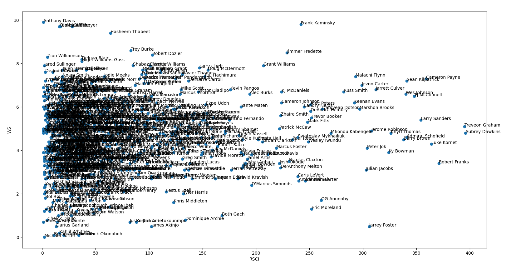

# NBA Draft Model

This is a Python college basketball data scraper + draft model.

## Installation

Install the relevant requirements with:

```bash
pip3 install -r requirements.txt
```

## Usage

As of 3/29/20, we only have support for a data scraper (pulling all college basketball prospects since 2009), a very basic graphing utility with the stats pulled from scraping, and three different machine learning algorithms to make NBA predictions on this year's NBA draft class. 

### Data Scraper

To use the data scraper, just call `python collegescrape.py` and it will generate a CSV of 1000+ prospects. I suggest pausing after Step 2 to do some manual data cleanup, because some players are left with funky names and w/o obvious RSCI ranks. I'm working on fixing that, but not in the plans right now. 

### Graph

Once you have the master.csv file populated, you can plot some simple scatter plots by calling `py graph.py` and following the steps. It's a super simple way to draw some baseline conclusions about successful college basketball prospects. Below is a graph I made comparing RSCI ranks with college win shares. 



### Machine Learning Models

You can also give the predictive model a try by calling `py model.py` and inputting the master.csv file. For scikit-learn's LogisticRegression model, it seems to be hovering around >70% accuracy. You can see the metrics below. 


With tensorflow, I am seeing mixed results. The current implementation I have is inconsistent but tops out at around 73%, with worse precision and better recall than sklearn's basic LogisticRegression algorithm. I am still tweaking the numbers to find out what works best.

Recently, as of 3/29/20, I've added a Gradient Boosting Classification model. This seems to have worse accuracy on the training data (~75%) than the other two models, but greater accuracy on the testing data (~75%). 

You can see the overall results of all three models in the `upcomingProspects.csv` file. I think the combination of all three models is really accurate in terms of creating a tier list of sorts. 

## Contributing
Pull requests are welcome. For major changes, please open an issue first to discuss what you would like to change.

If you have any questions, you can reach out to me on twitter [@MilosTeodopesic](https://twitter.com/MilosTeodopesic) or shoot me an email at [JasonG7234@gmail.com](mailto:JasonG7234@gmail.com).

## License
[MIT](LICENSE)
