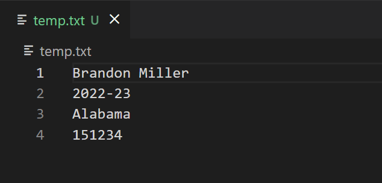
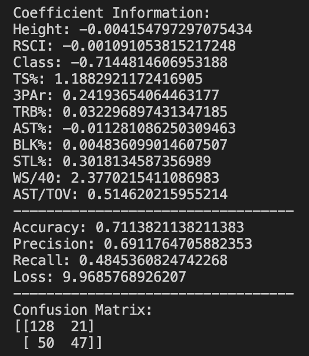

# NBA Draft Model

This is a Python NCAA basketball data scraper + draft model.

## Installation

Install the relevant requirements with:

```bash
pip3 install -r requirements.txt
```

## Usage

This is a college basketball scraper + ML model. To add a player, call `python add_player.py` with a `temp.txt` file with this format:



To add a team, call `python add_team.py`. From there, the prompts will be displayed to guide through what information is needed to get all the players' stats for the given team. This can be used to get all the stats 

## Data 

The average use case will likely just be pulling the data from the `/data` folder. `draft_db_20xx.csv` has all the historical draft prospects up until the current year, with stats from realgm, basketballreference, barttorvik, 247sports, and hoopmath. The `draft_db_20xx_special.csv` file has extra custom created data, such as Play Style, % Assisted Overall, Dunks per Minute Played, and some additional [Ben Taylor stats](https://fansided.com/2017/08/11/nylon-calculus-measuring-creation-box-score/).

### Machine Learning Models

You can also give the predictive model a try by calling `python src/draftmodel/model.py` and inputting the main csv file. For scikit-learn's LogisticRegression model, it seems to be hovering around >70% accuracy. You can see the metrics below. 



With tensorflow, I am seeing mixed results. The current implementation I have is inconsistent but tops out at around 73%, with worse precision and better recall than sklearn's basic LogisticRegression algorithm. I am still tuning the hyperparameters to find out what works best.

Recently, as of 3/29/20, I've added a Gradient Boosting Classification model. This seems to have worse accuracy on the training data (~75%) than the other two models, but greater accuracy on the testing data (~75%). 

You can see the overall results of all three models in the `2021predictions.csv` file. I think the combination of all three models is really accurate in terms of creating a tier list of sorts. 

## Acknowledgements

Player statistics sourced from [barttorvik](https://barttorvik.com/playerstat.php), [basketball-reference](https://www.sports-reference.com/cbb/), [hoop-math](https://hoop-math.com/), and [realgm](https://basketball.realgm.com/).<br/> RSCI data sourced from [247sports](https://247sports.com/college/basketball/recruiting/).<br/>
NBA Combine data sourced from [NBA.com](https://www.stats.nba.com).<br/>
Draft prospects before 2021 were sourced programmatically from [nbadraft.net](https://www.nbadraft.net/).

All sites are taken from manually scraping the site outside of the NBA Combine data, which is taken through the stats.nba.com API. Each stats site has its own implementation in the `src` folder. These stats/scrapers are all allowed under the sites' [Terms of Use](https://www.sports-reference.com/termsofuse.html).

## Contributing
Pull requests are welcome. For major changes, please open an issue first to discuss what you would like to change.

If you have any questions, you can reach out to me on twitter [@MilosTeodopesic](https://twitter.com/MilosTeodopesic) or shoot me an email at [JasonG7234@gmail.com](mailto:JasonG7234@gmail.com).

## License
[MIT](LICENSE)
